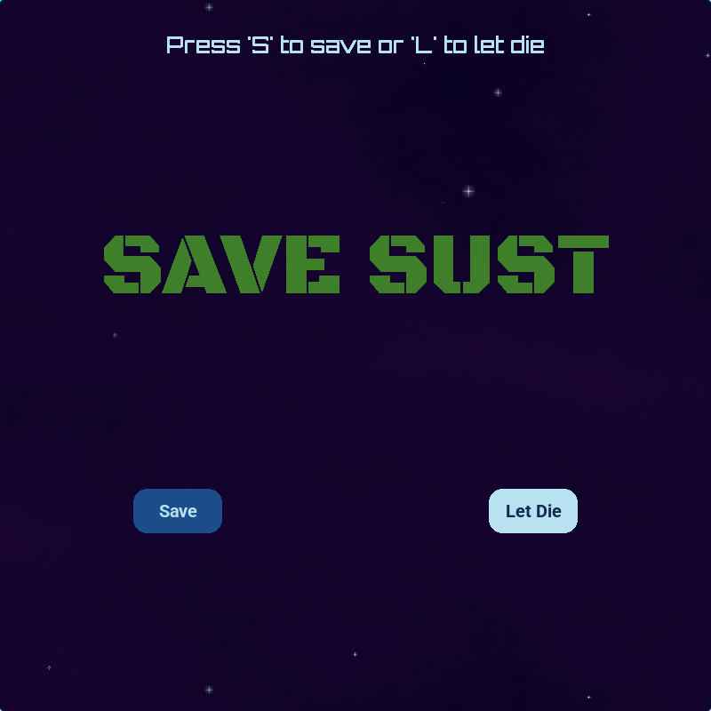
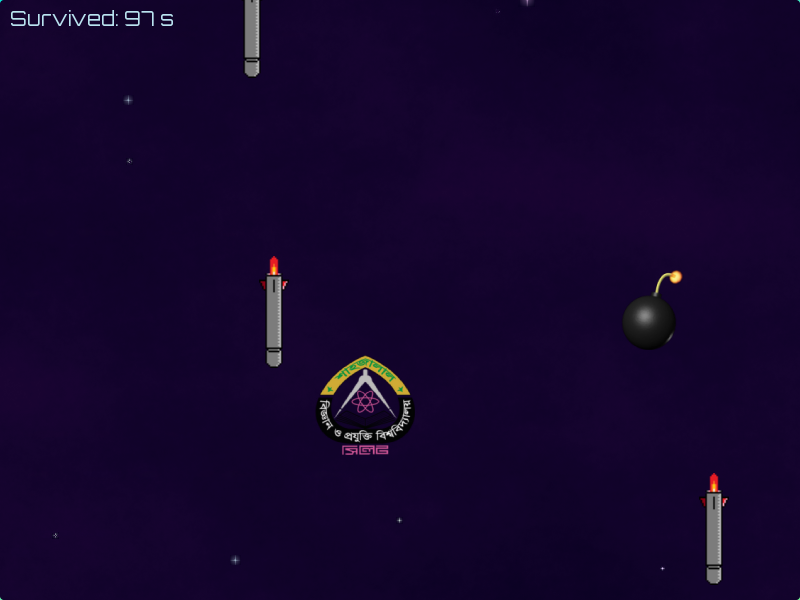
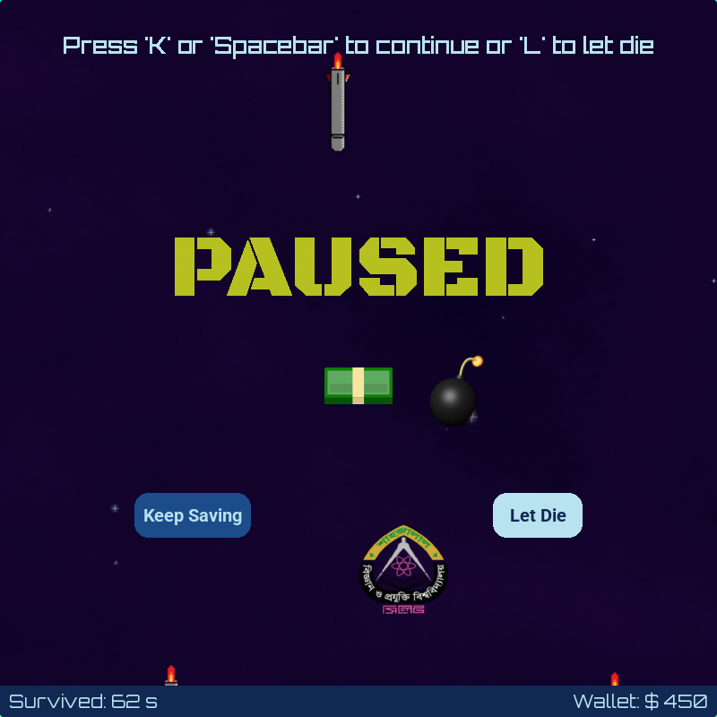
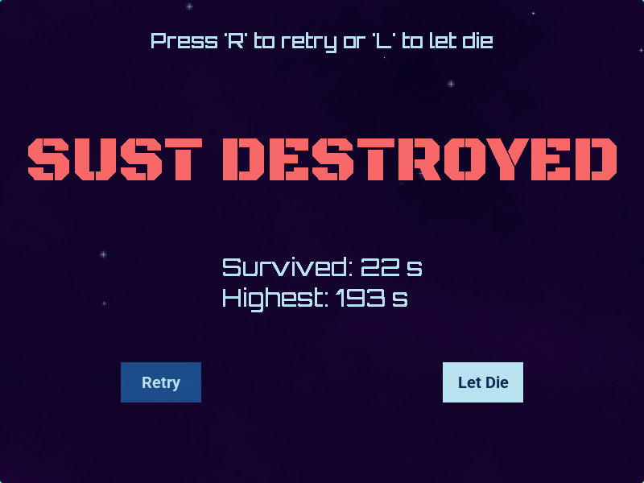

# Save Sust

Save Sust is an arcade-style game where you dodge falling missiles and bombs, keep the survival-time climbing, and try to save SUST as long as you can.

## Features

- Smooth top-down and left-right movement with keyboard controls
- Start, pause, and game-over menus
- Persistent high score
- Coin collection system with silver, gold, and money pickups
- Running wallet display in the HUD and game-over screen
- Simple Pygame CE-based project structure that is easy to extend

## Requirements

- Python 3.14 or newer
- `pygame-ce`
- `uv`

The project is configured in `pyproject.toml` and can be run with `uv` or from a virtual environment.

## Installation

1. Install `uv` if you do not already have it.
2. Sync dependencies from the project root:

```bash
uv sync
```

If you prefer a traditional virtual environment, you can also do that manually and install dependencies with:

```bash
pip install pygame-ce
```

## How To Run

With `uv`, launch the game from the project root with:

```bash
uv run python game.py
```

If you are using a manually created virtual environment, run:

```bash
python game.py
```

## How To Play

Your goal is to survive as long as possible while the survival-time increases and collect as many coins as you can along the way.

### Controls

- `S` at the start screen or the Save button: begin the game
- `L` at any menu: quit the game
- Arrow keys: move the player up, down, left, and right
- `Space` or `K` during gameplay: pause the game and resume play
- `R` on the game-over screen: restart the game

### Gameplay Notes

- Avoid the falling missiles and bombs.
- Collect falling prizes to increase your wallet:
  - `silverCoin`: $25
  - `goldCoin`: $50
  - `money`: $100
- The survival time increases automatically while you are alive.
- Your current wallet is shown in the bottom-right HUD and again on the game-over screen.
- If you collide with an obstacle, SUST gets destroyed and the game ends.

## Project Structure

- `game.py` contains the main game loop and sprite logic.
- `utils/` contains the menu, color, button, text, and high score helpers.
- `assets/` stores fonts, images, and sound effects.

## Screenshots










## Contributing

Contributions are welcome. A good change should be focused, easy to review, and consistent with the existing code style.

1. Fork or branch from the repository.
2. Make your changes in a small, well-defined commit.
3. Run the game locally to verify the behavior.
4. Update documentation when controls, assets, or setup steps change.
5. Open a pull request with a clear description of what changed and why.

If you add gameplay features, please include a short note about how to use them so the README stays accurate.

## License

This project is distributed under the terms of the [LICENSE](LICENSE) file in the repository.
